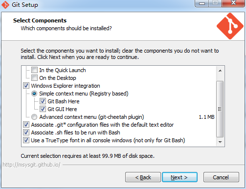
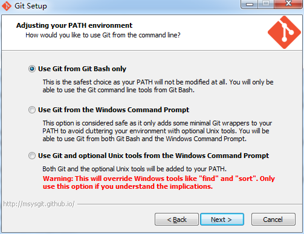
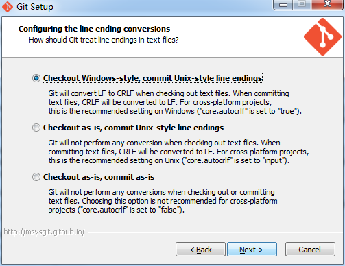

**如何使用 Git**
- 下载 <a href="http://git-scm.com/download/win" target="_blank">Git for windows</a>
- 下载 <a href="http://www.syntevo.com/smartgit/download" target="_blank">SmartGit for windows</a>

**安装Git**

**安装SmartGit**

