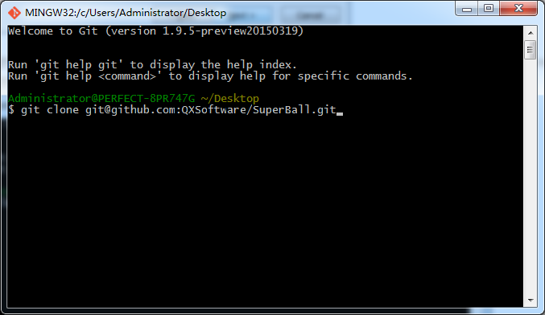

**如何使用 Git**
- 下载 <a href="http://git-scm.com/download/win" target="_blank">Git for windows</a>
- 下载 <a href="http://www.syntevo.com/smartgit/download" target="_blank">SmartGit for windows</a>

**安装Git**

按照上图的选项安装好了 git 后，找个地方准备放置项目文件，比如桌面，然后鼠标右键，点选 Git Bash Here，然后在弹出的黑色窗口中输入：git clone git@github.com:QXSoftware/SuperBall.git，然后回车：

等git执行完毕后，就可以浏览项目文件啦，此时可以关闭 git 命令行。

**安装SmartGit**

